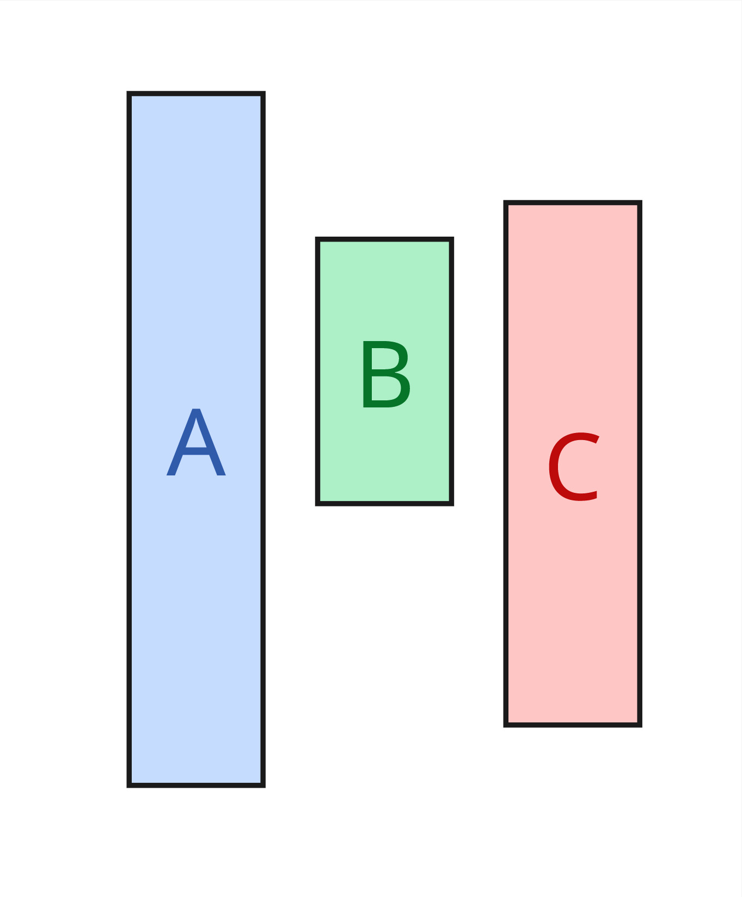

{style="display: flex; gap: 1rem; position:relative"}
> >
> > {width=300px}
> >
>
> >
> > {.block}
> > Having multiple cores running in parallel (like `pthread`) 
> >
> > {pause}
> > > ```C
> > > int i;
> > > pthread_t *pt = NULL;
> > > for (i = 0; i < N; i++) {
> > >   pthread_create(pt, NULL, run, &i);
> > > }
> > > ```