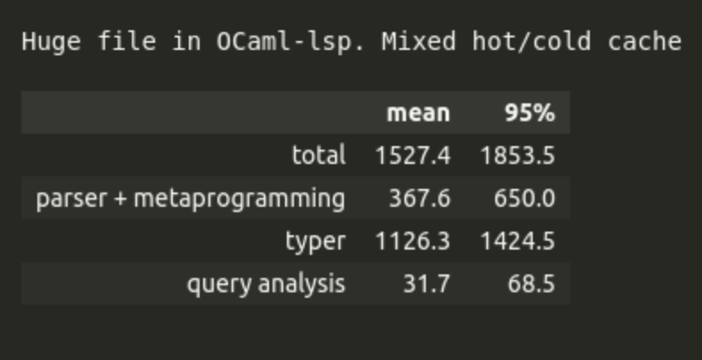
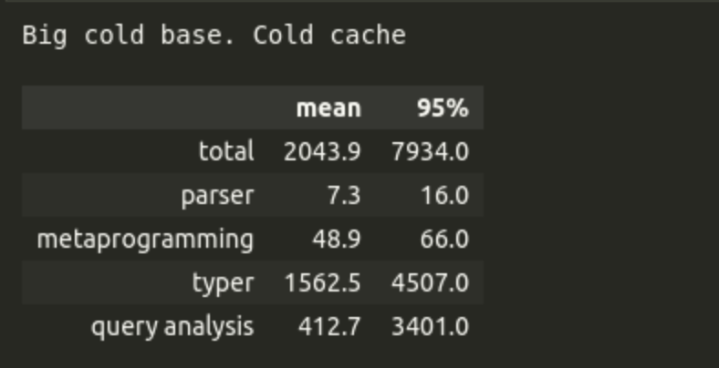

<!-- slipshow serve -o presentation/presentation.html presentation/presentation.md -->

{#beginning}

<h1 style="text-align: center;">✨When magic meets multicore</h1>
<h3 style="margin-top: -15px; text-align: center">🐪 OCaml and its elegant era of parallelism</h3>

{pause}

 

#### Content

1. OCaml :dromedary_camel:
2. OCaml's language server Merlin :female_mage:
   - demo
   - Merlin's control flow and performance
3. Leveraging OCaml 5 for performance
   - New mechanisms to improve performance
   - Implementations with OCaml 5
4. Bumps in the Road

{pause}

**Heads-up**: We're presenting an experiment. You'll see in the metrics section that there _are_ clear improvements, but not all are related to multicore and also, there are a few performance unknowns still.

{pause up-at-unpause=questions}

#### A few questions {#questions}

{pause}

{pause}

- Who of you has used OCaml? 🐪
  {pause}
- Who of you knows what LSP (langauge server protocol) is? 💬🖥️📋
  {pause}
- Who of you knows what a language server is? 💬🖥️

{pause up-at-unpause=ocaml}

#### OCaml 🐪 {#ocaml}

{include src=ocaml_intro.md}

{pause up-at-unpause=merlin}

#### OCaml's language server Merlin 🧙‍♀️ {#merlin}

Live demo!

{pause}

☝️ You've just seen OCamlLSP live.

✨✨ Merlin is the backend of OCamlLSP.

{pause unreveal=AST}

🌳 And this is a tree in Cádiz:

{ style="width:400px; vertical-align:middle; margin-right:2em;" }
 ----> Let's talk about ASTs. 

{reveal=AST}

{pause}

{#question_frontend}
**Question**: Who here remembers, e.g. from uni, roughly what an AST is and what the compiler frontend does? (lexing, parsing, typing) 🌳

{pause up-at-unpause=question_frontend}

An AST is a representation of the program in the form of a tree.

In OCaml, a statically typed language, there are two ASTs, both are made up of a list of **_top-level items_**:

- **Parsetree**: the raw syntax tree from parsing source code.
- **Typedtree**: a version of the syntax tree where the compiler has annotated every expression with its inferred type.

{pause}

The compiler frontend builds up these different representations of your program step by step. Merlin does the same.

{pause}

{pause up}
{#cfd}
{.svg-container include src=merlin_cfd_with_typer.svg #cfd}

{focus="rect26279-7-2"}

{unfocus}

{pause up}

#### Performance data (in milliseconds)

{ style="height:8em;" }

&nbsp; <!-- small spacer -->

{ style="height:8em;" }

&nbsp; <!-- small spacer -->

{ style="height:8em;" }

{pause up-at-unpause=cfd}

{pause up}
{#cache-section}

#### Cache mechanisms in Merlin

There are two cache mechanisms:

<!-- {pause style="text-align:center"} -->

{style="display: flex; position:relative"}
> {#part1 slip include src="file_cache.md"}
>
> {#part3 include src=typer_cache.md slip enter}
>

{pause up-at-unpause=cache-section}

{#take-away}
**Take-away from the typer cache** 🍕: When you modify a long file at the beginning of the file, Merlin can be very slow. If Merlin could speed up queries towards the beginning of a file, that'd be magic!✨

{pause up-at-unpause=take-away}

**Take-away from performance analysis** 🍣: The typer is the main performance bottlenecks. The query analysis can also be quite slow. Partly parallelising the two things would help.

{pause}

**Also** ✨➕✨: Currently, Merlin finishes the whole process for one query before starting the next. If there were a way to cancel in-progress work when new queries arrive, queries could respond even faster. LSP does skip queued queries. If Merlin could also cancel ongoing query processing, that’d be magic!

{include src=carine.md}

{pause up}

## Some metrics

{pause up}

#### Metrics

{pause up}

## Conclusion

{include src=conclusion.md}
