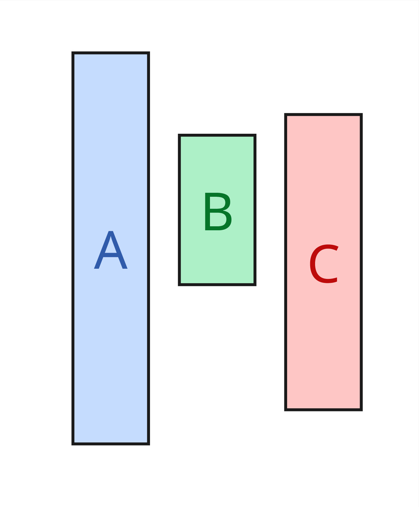

{style="display: flex; gap: 1rem; position:relative"}
> > 
> > {width=300px}
> >
>
> >
> > {.block}
> > Having multiple cores running in parallel
> >
> > 
> >
> > {#domain-example}
> > > ```ocaml
> > > let domainB = Domain.spawn (fun () -> some_work "B" ) in
> > > let domainC = Domain.spawn (fun () -> some_work "C") in 
> > > some_work "A";
> > >
> > > Domain.join domainB;
> > > Domain.join domainC
> > >```


<!-- 
> > > ```C
> > > int i;
> > > pthread_t *pt = NULL;
> > > for (i = 0; i < N; i++) {
> > >   pthread_create(pt, NULL, run, &i);
> > > }
> > > ``` -->