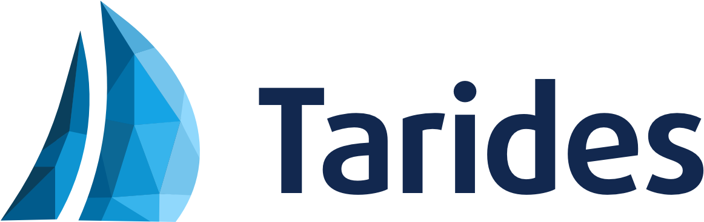
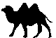
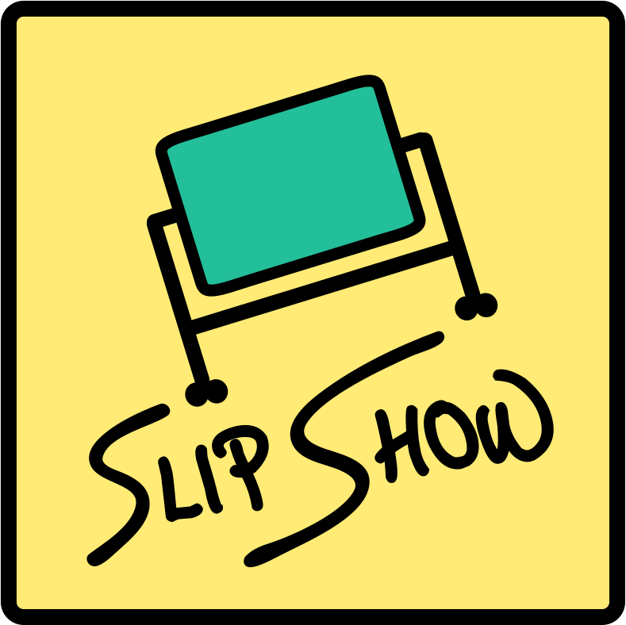

{up}
This talk was presented by Sonja Heinze and Carine Morel from
{width=200px}

{style="display: flex; position:relative"}
> > {width=180px}
>
> > {width=180px}
>
> > {width=180px}
>
> > {width=180px}
>
> > {width=180px}
>
> > {width=180px}
>
> > {width=180px}

## Credits 🐫
Powered by Slipshow {width=40px} (Slipshow is the tool we've used to create our "slides". Of course, written in OCaml! 🐪❤️)

Huge thanks to Benjamin for the camel GIFs,

Xavier, Abby and Timéo for their awesome work with us,

and Paul-Elliot for the 24/7 Slipshow support line!
