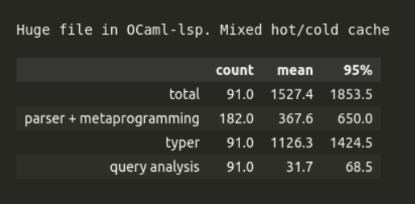
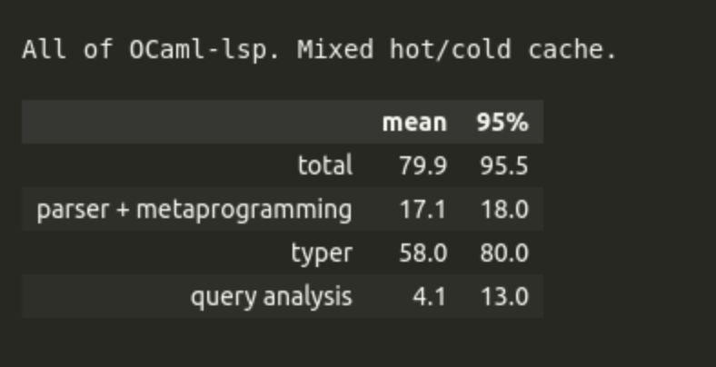
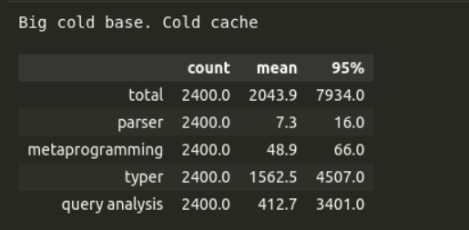
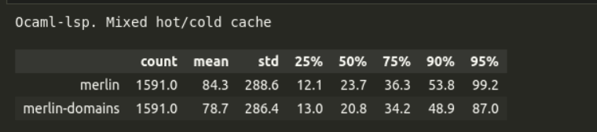
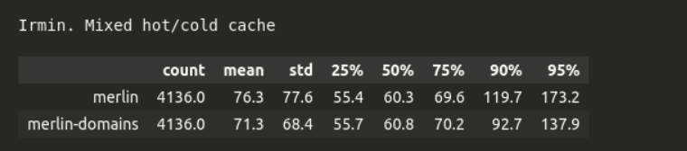
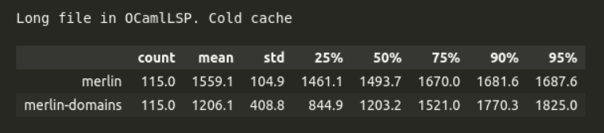

<!-- slipshow serve -o presentation/presentation.html presentation/presentation.md -->

{#beginning}

<h1 style="text-align: center;">✨When magic meets multicore</h1>
<h3 style="margin-top: -15px; text-align: center">🐪 OCaml and its elegant era of parallelism</h3>

{pause}

<br>

## Content

1. OCaml 🐪 (quick)
2. OCaml's language server Merlin 🧙‍♀️
   - Demo
   - Merlin's control flow and performance
3. Leveraging OCaml 5 for performance 🔥
   - New mechanisms to improve performance
   - Implementations with OCaml 5
4. Performance improvements and bumps in the road 🚧

<!-- {pause} -->

**Heads-up**: We're presenting an experiment. You'll see in Section 4. that there _are_ clear performance improvements, but also still things to improve and understand.

<!-- {pause up-at-unpause=questions}

## A few questions {#questions}

{pause}

{pause}

- Who of you has used OCaml? 🐪
  {pause}
- Who of you knows what LSP (langauge server protocol) is? 💬🖥️📋
  {pause}
- Who of you knows what a language server is? 💬🖥️ -->

{pause up}

## OCaml 🐪 {#ocaml}

{include src=ocaml_intro.md}

{pause up-at-unpause=merlin}

## OCaml's language server Merlin 🧙‍♀️ {#merlin}

Live demo!

{pause}

☝️ You've just seen OCamlLSP live.

✨✨ Merlin is the backend of OCamlLSP.

{pause unreveal=AST}

🌳 And this is a tree in Cádiz:

{ style="width:400px; vertical-align:middle; margin-right:2em;" }
<span id="AST" style="vertical-align:middle;"> ----> Let's talk about ASTs. </span>

{reveal=AST}

{pause}

{#question_frontend}
**Question**: Who here remembers, e.g. from uni, roughly what an AST is and what the compiler frontend does? (lexing, parsing, typing) 🌳

{pause up-at-unpause=question_frontend}

An AST is a representation of the program in the form of a tree.

In OCaml, a statically typed language, there are two ASTs:

- **Parsetree**: the raw syntax tree from parsing source code.
- **Typedtree**: a version of the syntax tree where the compiler has annotated every expression with its inferred type.

Both are composed of a list of **_top-level items_**, such as value definitions, types and modules.

{pause}

The compiler frontend builds up these different representations of your program step by step. Merlin does the same.

{pause}


{pause up}
{unreveal=g6}
{#cfd}
{.svg-container include src=images/merlin_cfd_with_typer.svg #cfd}

<style>
.svg-container svg {
  width: 45%;
  height: auto;
}
</style>

{focus="rect26279-7-2"}

{unfocus}

{pause up}

#### Performance data (in milliseconds)

{.block}
{style="display:flex; gap:5rem; position:relative"}
> > { style="height:8em;" }
>
> > Ok, we knew that editor support on this file is slow, because it's long.
> >
> > **Main bottleneck**: typer


<!-- {.block}
{style="display:flex; gap:5rem; position:relative"}
> > { style="height:8em;" }
>
> > On the whole code base it's quite ok. -->


{.block #perf_js}
{style="display:flex; gap:5rem; position:relative"}
> > { style="height:8em;" }
>
> > Note: Fully cold cache is not really a real-world scenario. We only use it for analysis.
> >
> > **Main bottleneck**: typer
> >
> > **Secondary bottleneck**: query analysis

{pause up-at-unpause=perf_js}

{reveal=g6}
{pause up-at-unpause=cfd}

{pause up}

{#cache-section}
#### Cache mechanisms in Merlin

There are two cache mechanisms:

{pause style="text-align:center"}
{style="display: flex; position:relative"}
> {#part1 slip include src="file_cache.md"}
>
> {#part3 include src=typer_cache.md slip enter}
>

{pause up-at-unpause=cache-section}

#### Take-away from the typer cache

When you modify a long file at the beginning of the file, Merlin can be very slow. <span style="color:green">**Speeding up queries towards the beginning of a file would be be magic!**</span> ✨


{style="display: flex; gap: 5rem; position:relative"}
> > {pause .block}
> > > **Early type return**: To type something at the start of the buffer, Merlin does not need to type what comes after.
> >
> > {pause}
> >
> > Works well most of the time! 
> >
> > With some rare exceptions, e.g. value restriction.
> 
> > {pause}
> > {carousel change-page='~n:"all"'}
> > ----
> > 
> > ---
> > 
> > >```ocaml
> > > let a = ref [] 
> > >
> > >
> > >
> > > 
> > > (*    end of buffer *)
> > >```
> > 
> > ---
> > 
> > >```ocaml
> > > let a = ref [] 
> > > (* '_weak list ref *)
> > >
> > >
> > > 
> > > (*    end of buffer *)
> > >```
> > 
> > ---
> > 
> > >```ocaml
> > > let a = ref [] 
> > > 
> > > 
> > > a := [ 1 ] 
> > > 
> > > (*    end of buffer *)
> > > ```
> > 
> > ---
> > 
> > >```ocaml
> > > let a = ref [] 
> > > (* int list ref *)
> > > 
> > >  a := [ 1 ]
> > >
> > > (*    end of buffer *)
> > > ```
> > 
> > ----


{pause up}
## Take-aways 🍕🍣

{.block}
Merlin is generally very fast. There are some concrete cases with performance issues particularly with very very long files or very large projects.

#### Parallelization
Problem : The typer is the main performance bottleneck. The query analysis can also be a bottleneck. 

<span style="color:green">**Solution: Let's try to parallelize the typing and the query analysis**</span> ✨

#### Cancellation mechanism
Problem: VSCode (and other editors) send cancellation requests to OCamlLSP that are currently mostly ignored. 

<span style="color:green">**Solution: Let's implement a mechanism in Merlin to cancel a query.**</span> ✨

#### Early typing return

Problem: When you modify a long file at the beginning of the file, Merlin can be very slow. 

<span style="color:green">**Solution: Let's implement early typing return!**</span> ✨


{pause up-at-unpause=cancel}


<style>
.svg-container-small svg {
  width: 100%;
  height: auto;
}
</style>


{include src=carine.md}

{pause up}
## Some metrics

{style="display:flex; gap:5rem; position:relative; margin-top:1px; margin-bottom:1px"}
> > { style="height:8em;" }
>
> > In P95: 12% faster
> >
> > In P25: 7% slower 😲

{pause}

<hr/>

{style="display:flex; gap:5rem; position:relative"}
> > { style="height:8em;" }
>
> > In P95: 20,5% faster
> >
> > In P25: 0,5% slower

{pause}

<hr/>

{style="display:flex; gap:5rem; position:relative"}
> > { style="height:8em;" }
>
> > P95: 8% slower 😲
> >
> > P25: 41% faster 🥳


{pause up}
## Conclusion

{include src=conclusion.md}

{pause up}
{include src=credits.md}
