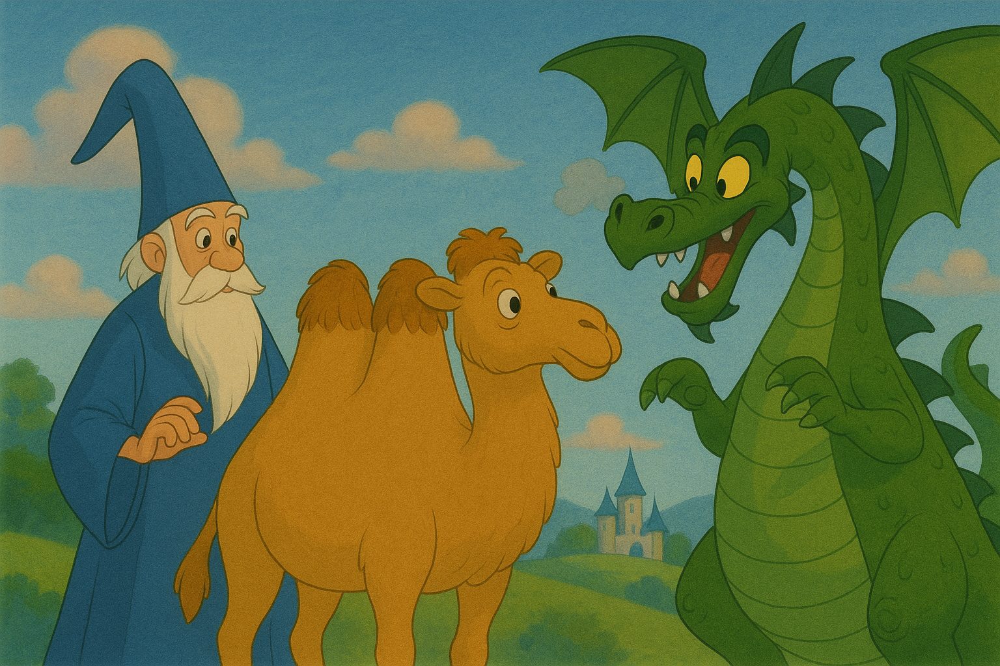

{pause up #summary}
## Summary

{carousel change-page='~n:"all"'}
----
{width=1200px}

---
{width=1200px}

---
{width=1200px}
----

{pause up #spell children:slip}
----

{#cancel}
---
# ✨ Cancellation Mechanism 

{pause}
Ability to cancel the current queries if a new one comes up.

*(Add something like a picture ?)*

{#partial}
---
# ⚡️ Partial Typing 
{.block pause}
**Idea**: if you need the type of a top-level item line 10, Merrlin does not need to type what comes after

{pause}
True most of the time!
{pause}
```ocaml
  let l = ref [] 
  (* '_weak1 list ref *)
  
  l := 1 :: !l
  (* int list ref *)
```
 ----

{pause up-at-unpause=spell}


{unfocus pause up #ocaml5}
## Brewing New Magics with OCaml 5

<!-- 🫕 New Magical Components -->

<!-- ✨ 🪄 🧙‍♂️ 🧙‍♀️ 🧹 🧪 🦄

🌊 🔥 🌪️ 🌱 ⚡️ 🪨 ❄️ 💥 -->

<!-- {pause style="text-align:center" up-at-unpause=ocaml5} -->

<style>
.svg-container svg {
  width: 80%;
  height: auto;
}
</style>

{style="display: flex; gap: 1rem; position:relative"}
> {slip}
> > # 🌱 Shared Memory Parallelism
> >
> > {pause}
> > Having multiple cores running in parallel (like `pthread`) {pause}
> >
> > *(Include a picture of several core running in //)*
> >
> > {.block title="Domains"}
> > ---
> >
> > A domain in OCaml is a **parallel execution unit** that has its own minor heap, and execution stack.
> > Domains allow OCaml programs to run **code in parallel on multiple CPU** cores without a global runtime lock.
> >
> > ---
> >
> > {pause style="display: flex; gap: 1rem; position:relative"}
> > > {slip}
> > > > {.svg-container pause include src=images/cancellation2.svg} 
> > > > {unreveal="step2-1 step3-1 step4-1"}
> > > >
> > > > {pause reveal="step2-1"}
> > > >
> > > > {pause reveal="step3-1"}
> > > >
> > > > {pause reveal="step4-1"}
> > > >
> > > {slip}
> > > > {pause}
> > > > {.svg-container include src=images/cancellation.svg} 
> > > > {unreveal="step2-2 step3-2 step4-2 step5-2 step6-2"}
> > > >
> > > > {pause reveal="step2-2"}
> > > >
> > > > {pause reveal="step3-2"}
> > > >
> > > > {pause reveal="step4-2"}
> > > >
> > > > {pause reveal="step5-2"}
> > > >
> > > > {pause reveal="step6-2"}
> > > >
> > > > 
> > >
> > ---
>
> {pause up-at-unpause=ocaml5}
>
> {#part2 slip enter}
> > # 🍄 Effect Handlers
> >
> > {pause}
> >
> > {.block title="Effects and effect handlers" color="blue" #eff}
> > ---
> >
> > An **effect** is an operation in a program that can **suspend the linear flow of execution** and delegate control to an external handler to decide how to proceed.
> > 
> > An **effect handler** captures and defines the behavior of effects when they are performed. It has access to the continuation (the rest of the computation).
> >
> > ---
> >
> > {pause up}
> >
> > {carousel change-page='~n:"all"' }
> > ----
> >
> > ```ocaml
> > type style = Emo | Text
> > type _ Effect.t += Love : style -> unit t | World : unit t
> > 
> > let foo () =
> >   Format.printf "I ";
> >   perform (Love Emo);
> >   Format.printf " Lambda World!@."
> > 
> > (* Prints "I ♥ Lambda World!"*)
> > let main () =
> >   match foo () with
> >   | () -> ()
> >   | effect World, k -> Format.printf "World"; continue k ()
> >   | effect Love style, k ->
> >     let str = match style with | Emo -> "♥" | Text -> "love"
> >     in
> >     Format.printf "%s" str;
> >     continue k ()
> > ```
> >
> > ---
> > {pause}
> > {.svg-container include src=images/partial_typing.svg } 
> > {unreveal="step2-3 step3-3 step4-3 step5-3 step6-3"}
> > 
> > {pause reveal="step2-3"}
> >
> > {focus="diagram_pipeline"}
> >
> > {pause reveal="step3-3"}
> >
> > {unfocus}
> >
> > {pause reveal="step4-3"}
> > 
> > {pause reveal="step5-3"}
> >
> > {pause reveal="step6-3"}
> >
> > ----
> > 
> {pause up-at-unpause=ocaml5}


<!-- {include src=images/cancellation2.svg up focus} 

{unreveal="listen1-1 waitinglisten2-1"}

{pause reveal="listen1-1 listen2-1"}

{unfocus} -->

<!--
 {pause up=merlin-multicore}
## 🧙‍♀️ Merlin +  🐫 OCaml 5 = ❤️?{#merlin-multicore}

```
🌱 Parallelism ➕ 🍄 Effect Handlers 
  🟰 ✨ Cancellation ➕ ⚡️ Partial Typing
    
```
{pause }

```
🧙‍♀️✨ Merlin ➕ ✨ ➕ ⚡️ 🟰 🐉❌  (Beast slain!)
```

{pause}
Seems like a great plan, right ?


But ... {pause} 
- Merlin has a lot of mutable states
- We can't change it too much

{.block pause}
With parallelism, isn't it the recipe for a **disaster** (i.e. data races 💥) ?

{pause}
So why even bother ?

{pause}
- OCaml 5 memory model is great! {pause}
- Merlin is a non-critical system. {pause}

{.block}
And also, it seemed very fun to try (and it was)!
 -->

{pause up}
## Brewing new spells 

*Explain the final design with the diagram and some carousel*

{pause }
{.svg-container include src=images/complete_graph.svg} 
{unreveal="step2-4 step3-4 step4-4 step5-4"}

{pause reveal="step2-4"}

{pause reveal="step3-4"}

{pause reveal="step4-4"}

{pause reveal="step5-4"}


{pause up}
## 🧙‍♀️ Merlin +  🐫 OCaml 5 = ❤️?{#merlin-multicore}

{pause}
And They lived happily ever after. 
[**The End 👑**]{focus}

{unfocus}

{pause}
Except:
- Merlin has a lot of mutable states
- We can't change it too much

{.block pause}
With parallelism, isn't it the recipe for a **disaster** (i.e. data races 💥) ?

blabla 

*graph with mutex*

{pause up}
## Some metrics 

{pause up}
## Conclusion

{pause .block}
Is it working ?

{pause} 
Yes!

{pause .block}
Do we still have data races ?

{pause}
Yes!

{pause .block}
Is it an issue ?

{Pause}
 Maybe. 

{#q3 pause .block}
Could we avoid data races at all? 
Yes, but:
- would limit parallelism

OR

- would require changing the internal typer

We are also exploring using a static way to enforce data-race freedom with modes thanks to a branch of OCaml called OxCaml.

{pause}
Yes, with ou without parallelism, there are many other ways to do it.

{pause up="q3" .block}
Would some design be better ?

{pause}
Most likely. We are currently exploring!

- single-core design
- guarantee data race free  

{pause .block}
What next ?

TODO

{pause up}
## What we've learned


