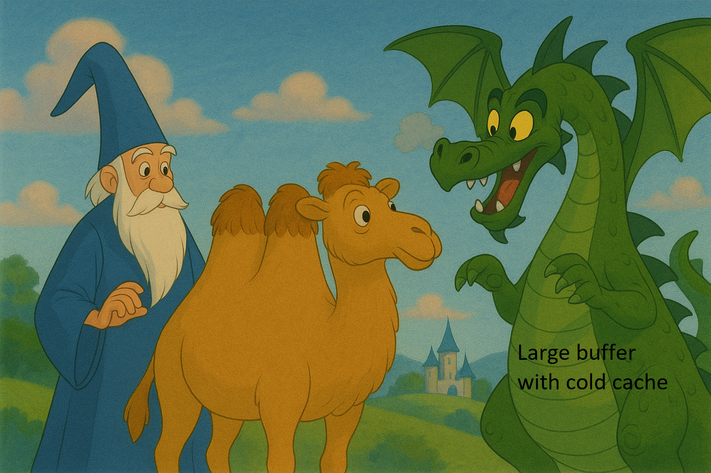

{pause up #summary}
## Summary


{carousel change-page='~n:"all"'}
----
{width=1200px}

---
{width=1200px}

---
{width=1200px}
----


{pause up #cancel}
## ✨ Cancellation Mechanism 

<!-- {pause unreveal #cancel_text} -->
{pause}
> Ability to cancel the current queries if a new one comes up.
> 


{#partial pause}
## ⚡️ Early Type Return

<!-- {reveal="cancel_text"} -->

{style="display: flex; gap: 5rem; position:relative"}
> {split}
> > 
> > {.svg-container-small include src=images/pipeline.svg} 
>
> {split}
> > {.block pause}
> > **Idea**: if you need the type of a top-level item line 10, Merlin does not need to type what comes after.
> >
> > {pause}
> >
> > Work in  most of the time! 
> >
> > Except: value restriction.
> >
> > {pause}
> > {carousel change-page='~n:"all"'}
> > ----
> > 
> > ---
> > 
> > >```ocaml
> > > let l = ref [] 
> > >
> > >
> > > (* end of buffer *)
> > >```
> > 
> > ---
> > 
> > >```ocaml
> > > let l = ref [] 
> > > (* '_weak1 list ref *)
> > >
> > > (* end of buffer *)
> > >```
> > 
> > ---
> > 
> > >```ocaml
> > > let l = ref [] 
> > > 
> > > 
> > >  l := [ 1 ] 
> > >
> > >  (* end of buffer *)
> > > ```
> > 
> > ---
> > 
> > >```ocaml
> > > let l = ref [] 
> > > (* int list ref *)
> > > 
> > >  l := [ 1 ]
> > >
> > >  (* end of buffer *)
> > > ```
> > 
> > ----


{pause up-at-unpause=spell}


<style>
.svg-container-small svg {
  width: 120%;
  height: auto;
}
</style>